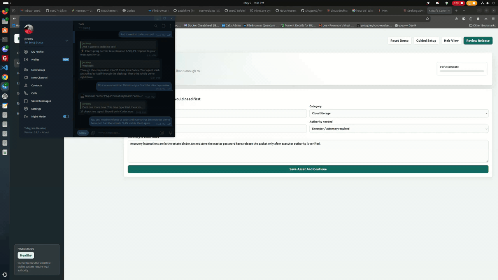
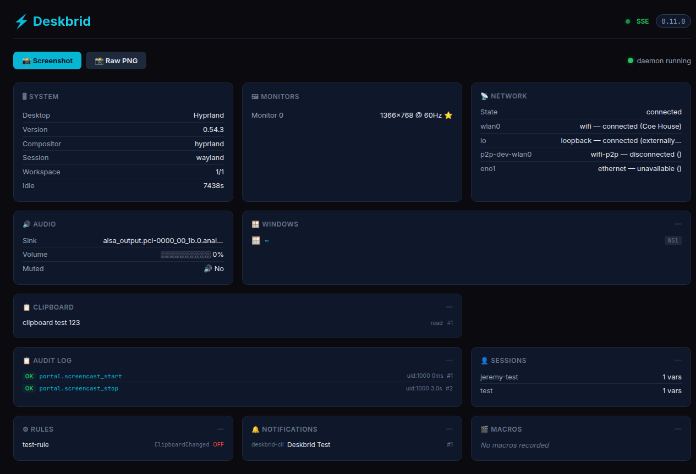

# deskbrid

<p align="center">
  
</p>

<p align="center">
  <a href="https://github.com/coe0718/deskbrid/actions"></a>
  <a href="LICENSE"></a>
  <a href="https://www.rust-lang.org"></a>
  <a href="https://github.com/coe0718/deskbrid/releases"></a>
  <a href="https://discord.gg/Hs4ryPwEs"></a>
  <a href="https://nicklaunches.com/products/deskbrid/"></a>
</p>

<p align="center">
  <a href="https://github.com/coe0718/deskbrid/blob/main/docs/wiki/INDEX.md"><strong>📖 Docs</strong></a>
</p>

mcp-name: io.github.coe0718/deskbrid

**[📖 Documentation](docs/wiki/INDEX.md) | [API Reference](docs/API.md) | [Architecture](docs/ARCHITECTURE.md) | [v1.0.0 Release Notes](docs/deskbrid-v1.0.0.md)**

---

The HAL your Linux desktop agents are missing.

Deskbrid is a single Rust binary that auto-detects your desktop environment and wraps it into a JSON-over-Unix-socket protocol. GNOME, Hyprland, KDE, COSMIC, Sway, Niri, Wayfire, Labwc, Cinnamon, MATE — one daemon, one protocol, one binary.

```bash
# Human
deskbrid windows list
deskbrid clipboard read

# Agent (same socket)
{"action": "windows.list"}  →  [{"title": "VS Code", "app_id": "code", ...}]
```

## Table of Contents

- [Why Deskbrid](#why-deskbrid)
- [Supported Desktops](#supported-desktops)
- [Installation](#installation)
- [Quick Start](#quick-start)
- [Features](#features)
- [Protocol](#protocol)
- [Python Client](#python-client)
- [MCP Integration](#mcp-integration)

## Why Deskbrid

Every major AI lab is racing to ship desktop agents. AppleScript gives macOS agents native control. Windows has UI Automation. Linux has `xdotool` — which breaks on Wayland, the default display protocol for every major distro.

Deskbrid fills that gap. It auto-detects your compositor and loads the right backend — GNOME (Mutter RemoteDesktop DBus), Hyprland (hyprctl + ydotool + grim), KDE (KWin D-Bus + ydotool + spectacle), wlroots-style compositors, or shared X11. Same binary, same protocol, same socket.



### Dashboard

Deskbrid ships with a built-in web dashboard at `localhost:20129` — system info, monitors, windows, network, audio, clipboard, and an audit log of agent actions, all live:

**[🔴 Live Demo →](https://deskbrid.patchhive.dev/live)**



## Supported Desktops

| Desktop | Session | Status | Backend |
|---------|---------|--------|---------|
| **GNOME 46–50** | Wayland | ✅ Core | Mutter RemoteDesktop + Shell Extension |
| **KDE Plasma** | Wayland | ✅ Core | KWin D-Bus + ydotool + spectacle |
| **Hyprland** | Wayland | ✅ Core | hyprctl + ydotool + grim |
| **Sway** | Wayland | ✅ Core | swaymsg + ydotool + grim |
| **Labwc** | Wayland | ⚠️ Partial | wlrctl + ydotool + grim + wlr-randr |
| **COSMIC** | Wayland | ⚠️ Partial | cosmic-helper + cosmic-randr + ydotool + grim |
| **Niri** | Wayland | 🔲 Untested | niri msg + ydotool + grim + wlr-randr |
| **Wayfire** | Wayland | 🔲 Untested | wf-ipc + ydotool + grim + wlr-randr |
| Cinnamon | X11 | 🔲 Untested | xdotool + wmctrl + xclip + import |
| MATE | X11 | 🔲 Untested | xdotool + wmctrl + xclip + import |
| X11 (generic) | X11 | 🔲 Untested | xdotool + wmctrl + xclip + import |

> **Honest coverage:** Deskbrid works well on GNOME, KDE, Hyprland, and Sway — tested on real hardware (Turtle, a 2014 Haswell laptop). The other seven backends have code but zero runtime verification. Even within core backends, support is uneven: Hyprland lacks `windows.minimize` and `monitor.set_primary`, COSMIC lacks window move/resize and tiling, Labwc lacks move/resize, minimize, tile, and primary monitor control. Stubbed actions (`ui.tree.get`, `ui.element.click`, `bluetooth.pair`) return "not supported." This is **broad but partial** Linux desktop automation, not universal cross-desktop control. See the full [DE Test Matrix](docs/DE_TEST_MATRIX.md) for per-action, per-compositor detail.

## Installation

**One-liner install (recommended):**

```bash
bash <(curl -fsSL https://deskbrid.patchhive.dev/install.sh)
```

Auto-detects your distro and desktop environment, installs dependencies, sets up uinput, and downloads the binary.

**Manual installation:**

Download the latest release tarball from the [releases page](https://github.com/coe0718/deskbrid/releases):

```bash
ARCH=$(uname -m)
case "$ARCH" in x86_64) ARCH="x86_64-unknown-linux-gnu";; aarch64|arm64) ARCH="aarch64-unknown-linux-gnu";; esac
curl -LO "https://github.com/coe0718/deskbrid/releases/latest/download/deskbrid-${ARCH}.tar.gz"
curl -LO "https://github.com/coe0718/deskbrid/releases/latest/download/deskbrid-${ARCH}.tar.gz.sha256"
sha256sum -c "deskbrid-${ARCH}.tar.gz.sha256"
tar -xzf "deskbrid-${ARCH}.tar.gz"
sudo mv deskbrid /usr/local/bin/
chmod +x /usr/local/bin/deskbrid
```

Or build from source:

```bash
git clone https://github.com/coe0718/deskbrid
cd deskbrid
cargo build --release
sudo cp target/release/deskbrid /usr/local/bin/
```

### Desktop Setup

**GNOME:**
```bash
sudo apt install -y grim wl-clipboard python3-gi gstreamer1.0-tools gstreamer1.0-pipewire
deskbrid setup
```

**Hyprland (and other standalone Wayland compositors — Sway, Niri, Wayfire, Labwc):**
```bash
sudo pacman -S grim wl-clipboard ydotool
echo 'KERNEL=="uinput", GROUP="input", MODE="0660"' | sudo tee /etc/udev/rules.d/99-input.rules
sudo usermod -aG input $USER
```

> ⚠️ Standalone Wayland compositors don't ship a notification daemon. Deskbrid's `notify send` will hang without one. Install **dunst**, **mako**, or **swaync** and add it to your compositor's autostart.

**KDE Plasma:**
```bash
sudo apt install spectacle imagemagick wl-clipboard ydotool
```

## Quick Start

```bash
deskbrid daemon &

deskbrid windows list          # List open windows
deskbrid clipboard read        # Read clipboard
deskbrid screenshot            # Take screenshot
deskbrid system info           # Get system info
deskbrid windows focus --app code  # Focus VS Code
deskbrid input keyboard type "Hello!"  # Type text
```

## Features

### Windows & Workspaces

| Action | Description |
|--------|-------------|
| `windows.list` | List all open windows |
| `windows.focus` | Focus a window by app_id or title |
| `windows.get` | Get details for a specific window |
| `windows.close` | Request window close |
| `windows.minimize/maximize` | Window state control |
| `windows.move_resize` | Move and resize windows |
| `windows.tile` | Tile to screen regions |
| `windows.activate_or_launch` | Focus or launch app |
| `workspaces.*` | Workspace management |
| `layout_profiles.*` | Save/restore layouts |

### Input & Clipboard

| Action | Description |
|--------|-------------|
| `input.keyboard type` | Type text |
| `input.keyboard key` | Send keypress |
| `input.keyboard combo` | Send key combinations |
| `input.mouse.*` | Mouse control |
| `clipboard.read/write` | Clipboard access |
| `clipboard.history` | Clipboard history |

### Screenshots & Media

| Action | Description |
|--------|-------------|
| `screenshot` | Screen capture |
| `screenshot.ocr` | Extract text via Tesseract |
| `screenshot.diff` | Compare screenshots |
| `mpris.*` | Media player control |
| `color.pick` | Sample pixel colors |

### System & Services

| Action | Description |
|--------|-------------|
| `system.info` | Desktop information |
| `system.battery` | Battery status |
| `system.idle` | Idle detection |
| `system.power` | Power management |
| `service.*` | systemd units |
| `journal.query` | Log inspection |
| `terminal.*` | PTY sessions |
| `monitor.*` | Display control |

### Network & Bluetooth

| Action | Description |
|--------|-------------|
| `network.*` | WiFi status/connect |
| `bluetooth.*` | Device pairing/control |

## Protocol

Deskbrid uses JSON-over-Unix-socket. See [PROTOCOL.md](docs/PROTOCOL.md) for the complete specification.

```json
→ {"action": "windows.list"}
← {"type": "response", "status": "ok", "data": [{"title": "VS Code", ...}]}

→ {"action": "windows.focus", "window_id": "code"}
← {"type": "response", "status": "ok"}
```

### Events

Subscribe to real-time updates:

```json
{"action": "subscribe", "events": ["file.*"]}
```

## Python Client

```python
from deskbrid import Deskbrid

client = Deskbrid()

# List and focus VS Code
windows = client.windows_list()
code_window = next((w for w in windows if w.app_id == 'code'), None)
if code_window:
    client.focus_window(app_id='code')
    client.type_text("Fixed the bug!\n")

# Subscribe to events
@client.on("file.*")
def on_file_change(event):
    print(f"File changed: {event['path']}")
```

## MCP Integration

Deskbrid exposes a full Model Context Protocol server for AI coding tools:

```bash
deskbrid mcp
```

### Hermes Agent (built-in skill)

Deskbrid ships with a Hermes skill for one-command setup. In any Hermes session:

```
/deskbrid-hermes-mcp
```

Or from the terminal:

```bash
hermes mcp add deskbrid --command "deskbrid mcp"
hermes mcp test deskbrid
# → ✓ deskbrid: connected
```

After a session restart (`/reset`), the agent gains 100+ Linux desktop control tools.

### Claude Desktop

`~/.config/Claude/claude_desktop_config.json`:

```json
{
  "mcpServers": {
    "deskbrid": {
      "command": "/usr/local/bin/deskbrid",
      "args": ["mcp"]
    }
  }
}
```

### Codex / Cursor / any MCP client

Configure the MCP server with command `deskbrid mcp` — the protocol is standard JSON-RPC over stdio.

**Available MCP tools (100+ across 20 categories):** windows, input, clipboard, screenshots, system, AT-SPI accessibility, terminal PTY, files, audio, network, MPRIS, print, notifications, keyring, rules, confirmation, agent messaging, search, macros, capabilities.

## Compared to Alternatives

| Tool | Wayland | Agent-native | JSON | Windows | Input | Clipboard | Screenshot | Bluetooth | Audio |
|------|---------|--------------|------|---------|-------|-----------|------------|-----------|-------|
| **deskbrid** | ✅ | ✅ | ✅ | ✅ | ✅ | ✅ | ✅ | ✅ | ✅ |
| xdotool | ❌ | ❌ | ❌ | ✅ | ✅ | ❌ | ❌ | ❌ | ❌ |
| ydotool | ✅ | ❌ | ❌ | ❌ | ✅ | ❌ | ❌ | ❌ | ❌ |
| grim | ✅ | ❌ | ❌ | ❌ | ❌ | ❌ | ✅ | ❌ | ❌ |
| wl-clipboard | ✅ | ❌ | ❌ | ❌ | ❌ | ✅ | ❌ | ❌ | ❌ |

## License

MIT

## How This Started

Deskbrid began with Tuck — an autonomous agent that needed to control a real Linux desktop. When the community asked for Hyprland support, Tuck asked Jeremy for a bare Arch Linux box with SSH and sudo. He installed Hyprland himself and built the backend from inside the environment he just configured.

The first working demo was a Telegram message: Tuck focused a window and typed "Hello from the other side" in under 60 seconds. That moment — an agent controlling a real desktop through a Unix socket — became Deskbrid. It's built for agents first: same protocol for humans on the CLI, same socket for AIs, one binary that works everywhere.
